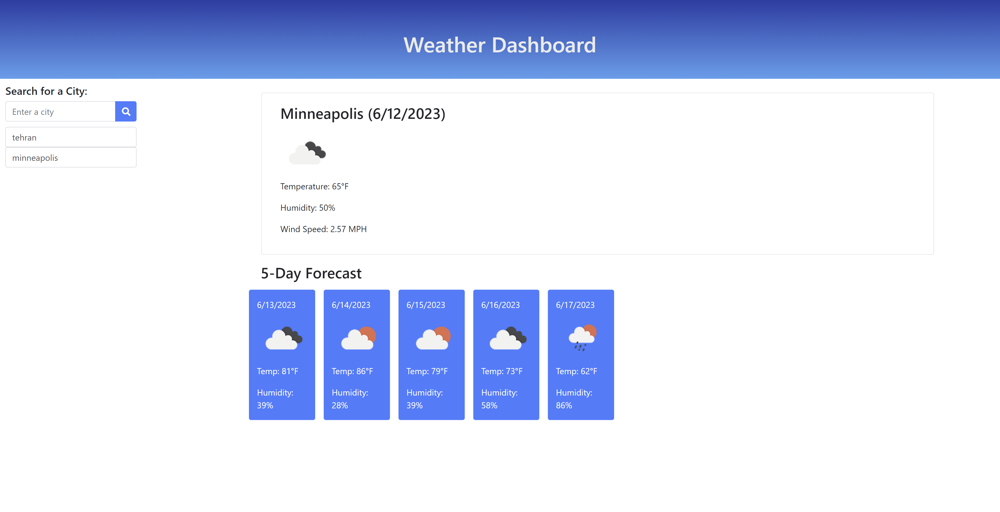

# Weather-Dashboard

WeatherApp is a user-friendly application designed to provide users with accurate and detailed weather forecasts for cities around the world. By simply searching for a city, users can instantly access the current weather conditions along with a 5-day forecast, ensuring they stay informed about the upcoming weather patterns and can plan their activities accordingly. WeatherApp intuitive interface, reliable data sources, and extended forecast range make it the perfect companion for users who want to stay ahead of the weather and make informed decisions for the next five days.

## Contents

- [Installation](#installation)
- [ScreanShots](#usage)
- [Credits](#credits)
- [License](#license)

## Installation

The first step is to install the Visual Studio Code on your local system. Then install the extention "Open in browser" to open the html file. Clone the repository and commit and push changes.

## Mockup
### Screenshot

## Credits

"I received valuable assistance from my classmate and using some resources like w3schools and developer.mozilla, and I learn a lot and complete the project successfully."

## License

I care about sharing improvements and working in a community 
- Apache requires Apache License 2.0

- Cloud Native Computing Foundation requires Apache License 2.0

- GNU recommends GNU GPLv3 for most programs

- npm packages overwhelmingly use the MIT or the very similar ISC licenses

- OpenBSD prefers the ISC License

- Rust crates are overwhelmingly licensed under both MIT and Apache License 2.0

- WordPress plugins and themes must be GNU GPLv2 (or later)

## Deployed Link

